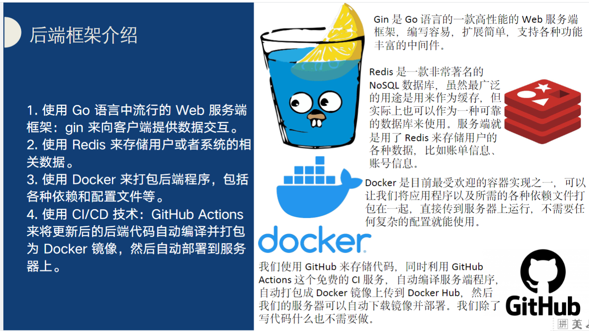
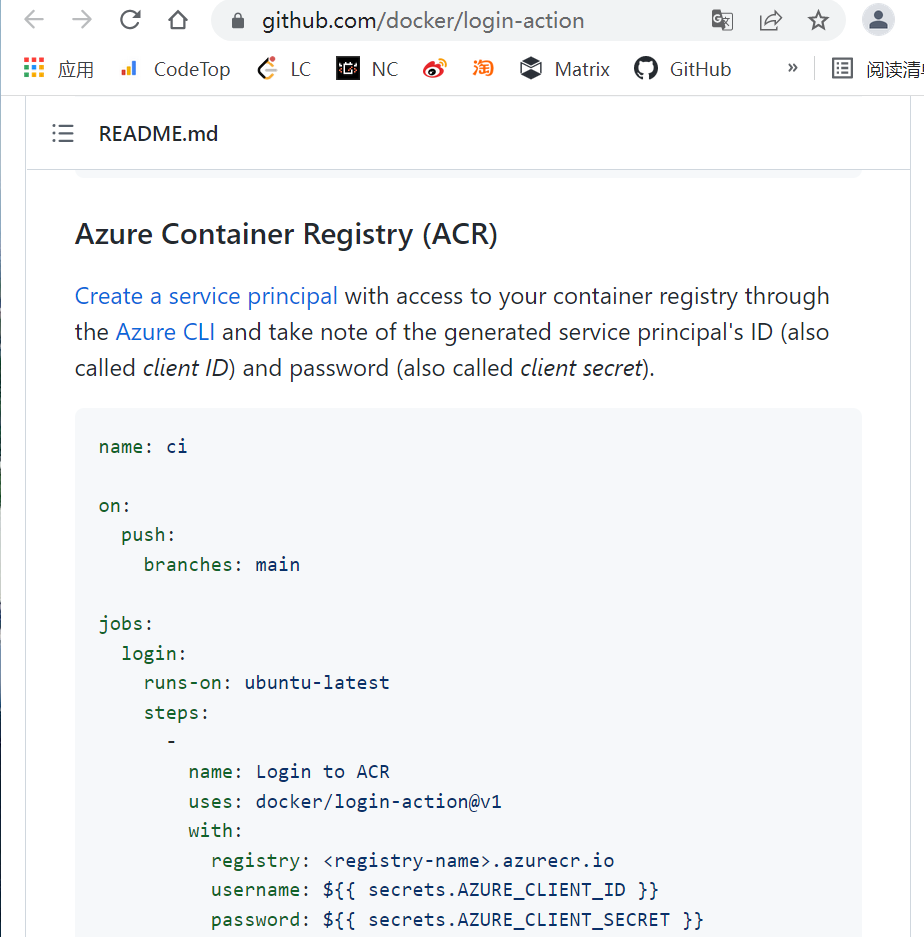

# README

## 所用框架介绍



## Gin

官网https://gin-gonic.com/zh-cn/docs/

WEB服务端框架，用于向客户端提供数据交互

支持使用自定义中间件，用router.Use(中间件)即可，比如gin有下面两个中间件：

- Logger中间件可以让我们做打印的一些自定义配置
- Recovery中间件可以让我们从崩溃中恢复

使用方式

```
router.Use(gin.Logger())
router.Use(gin.Recovery())
```

更多自定义中间件方法如下：

https://studygolang.com/articles/23836?fr=sidebar

## docker

网课https://www.bilibili.com/video/BV11L411g7U1?p=1

页面教程https://docker.easydoc.net


Docker 可以让开发者打包他们的应用以及依赖包到一个轻量级、可移植的容器中，成为镜像，然后发布到任何流行的 Linux 机器上，也可以实现虚拟化。

作为容器将程序和依赖文件打包在一起，使服务器只需要下载镜像并使用即可

主要是dockerfile编写

golang有通用的dockerfile编写demo：下面是适用于go mod模式的（自动寻找库文件）

```
FROM golang:latest as build
#ENV GOPROXY https://goproxy.io
ENV GO111MODULE on
WORKDIR /go/cache
ADD go.mod .
ADD go.sum .
RUN go mod download
WORKDIR /go/release
ADD . .
RUN GOOS=linux CGO_ENABLED=0 go build -ldflags="-s -w" -installsuffix cgo -o gin_demo main.go
 
FROM scratch as prod
COPY --from=build /usr/share/zoneinfo/Asia/Shanghai /etc/localtime
COPY --from=build /go/release/gin_demo /
COPY --from=build /go/release/conf ./conf
```

对比下面MOSAD用到的dockerfile

```
FROM golang:alpine as base
COPY . /build
WORKDIR /build
RUN CGO_ENABLED=0 GOOS=linux GOARCH=amd64 GO111MODULE=on go build -o server .
# 这条RUN先是设置了env然后调用go build编译所有文件，生成可执行文件server

FROM scratch
# 拷贝/build/server文件到当前目录下，并RUN执行
COPY --from=base /build/server /
CMD ["/server"]
```

## github actions

由github来自动实现对更新好的代码的打包镜像及部署，也就是调用docker的过程

workflow/.yml的编写，参考https://github.com/docker/build-push-action的demo

```
name: ci

on:
  push:
    branches:
      - 'main'

jobs:
  docker:
    runs-on: ubuntu-latest
    steps:
      -
        name: Set up QEMU
        uses: docker/setup-qemu-action@v1
      -
        name: Set up Docker Buildx
        uses: docker/setup-buildx-action@v1
      -
        name: Login to DockerHub
        uses: docker/login-action@v1 
        with:
          username: ${{ secrets.DOCKERHUB_USERNAME }}
          password: ${{ secrets.DOCKERHUB_TOKEN }}
      -
        name: Build and push
        uses: docker/build-push-action@v2
        with:
          push: true
          tags: user/app:latest
```

uses表示使用别人写好的actions，如调用github actions库使用名为*checkout*的GitHub Action从存储库中提取源代码*。*该操作将您的存储库签出到`$GITHUB_WORKSPACE`，以便您的工作流可以访问存储库的内容：`- uses: actions/checkout@master`。

```
name: ci
# 名称
on:
# 指定触发事件，并限定分支为master。
  push:
    branches:
      - "main"

jobs:
  # 取docker为job_id
  docker:
    # 定义环境在ubantu中运行
    runs-on: ubuntu-latest

    steps:
    #运行流程，按顺序执行
    #uses表示使用别人写好的命令
      - name: Set up QEMU
        uses: docker/setup-qemu-action@v1
      - name: Set up Docker Buildx
        uses: docker/setup-buildx-action@v1
      - name: Login to DockerHub
        uses: docker/login-action@v1
        with:
          username: ${{ secrets.DOCKERHUB_USERNAME }}
          password: ${{ secrets.DOCKERHUB_TOKEN }}
      - name: Build and push
        id: docker_build
        uses: docker/build-push-action@v2
        with:
          push: true
          tags: darkyzhou/mosad-server:latest
```

对于Azure 用法不一致，具体参考github.com/docker



## REDIS

使用redis的命令都是原子操作

goredis库的官方文档https://pkg.go.dev/github.com/go-redis/redis/v8#pkg-examples

所有命令的源码在这，包括了API用法https://github.com/go-redis/redis/blob/v8.11.4/commands.go#L1436

下面一篇CSDN博客是goredis库的使用方法总结，但是版本不同https://www.cnblogs.com/rush-peng/p/15013695.html，已整理至【程设-redis操作API文件夹】

下面是一个使用redis的实例redis twitter，使用的语言是PHP，里面包括了对列表，集合，哈希键值对集合，有序集合等操作方法https://redis.io/topics/twitter-clone

## Viper

spf13/viper——Go应用程序的完整配置解决方案

viper支持的功能：
1、可以设置默认值
2、可以加载多种格式的配置文件，如JSON，TOML，YAML，HCL和Java属性配置文件
3、应用程序运行过程中，保持监听和重新读取配置文件
4、可以从环境变量读取配置
5、可以从远程配置系统读取配置
6、可以读取命令行标志作为配置
7、可以从缓冲区中读取
8、设置显式的值

#### 该项目所读取的配置格式toml

先介绍JSON：它是类似于JavaScript那样定义对象的写法

```
{
    "a": "a",
    "b": "b",
    "c":{
        "x": "c.x",
        "y": "c.y"
    },
    "d":{
        "x": "d.x",
        "y": "d.y"
    },
    "e":[
        { "x":"e[0].x", "y":"e[0].y" },
        { "x":"e[1].x", "y":"e[1].y" }
    ]
}
```

而YAML直接将JSON中括号去掉改为了缩进

```
a1: abc  # string
a2: true # boolean
b1: nil  # string
b2: null # null
b3: NULL # null
b4: NuLL # string
b5: Null # null
c:
  x: c.x
  y: c.y
d:
  x: d.x
  y: d.y
e:
  - x: e[0].x
    y: e[0].y
  - x: e[1].x
    y: e[1].y
```

而toml则十分清晰简单，为了方便可以指定小节名。妙的是，小节名也是可以链式声明的。另外，某些数据可能使用内联数组或表更合适以避免臃肿，这也是支持的。用法教程：https://www.cnblogs.com/unqiang/p/6399136.html

```
a = "a"
b = "b"

c.x = "c.x"
c.y = "c.y"

[d]
x = "d.x"
y = "d.y"

[[e]]
x = "e[0].x"
y = "e[0].y"

[[e]]
x = "e[1].x"
y = "e[1].y"

[f.A]
x.y = "f.A.x.y"

[f.B]
x.y = """
f.
  B.
    x.
      y
"""

[f.C]
points = [
    { x=1, y=1, z=0 },
    { x=2, y=4, z=0 },
    { x=3, y=9, z=0 },
]
```

##  JWT -- JSON WEB TOKEN

在之前的一些web项目中，我们通常使用的是`Cookie-Session`模式实现用户认证。

1. 用户在浏览器端填写用户名和密码，并发送给服务端
2. 服务端对用户名和密码校验通过后会生成一份保存当前用户相关信息的session数据和一个与之对应的标识（通常称为session_id）
3. 服务端返回响应时将上一步的session_id写入用户浏览器的Cookie
4. 后续用户来自该浏览器的每次请求都会自动携带包含session_id的Cookie
5. 服务端通过请求中的session_id就能找到之前保存的该用户那份session数据，从而获取该用户的相关信息。

这种方案依赖于客户端（浏览器）保存Cookie，并且需要在服务端存储用户的session数据。

JWT就是一种**基于Token**的轻量级认证模式，服务端认证通过后，**会生成一个JSON对象**，经过**签名后得到一个Token**（令牌）再发回给用户，用户后续请求只需要带上这个Token，服务端解密之后就能获取该用户的相关信息了。

- 用户使用用户名密码来请求服务器
- 服务器进行验证用户的信息
- 服务器通过验证发送给用户一个token
- 客户端存储token，并在每次请求时附送上这个token值
- 服务端验证token值，并返回数据

这样就不用每次用户请求都验证session值

（官方文档）https://github.com/appleboy/gin-jwt，有demo可以学习

## go-playground / validator

validator参数校验

示例

```go
package main
 
import (
	"fmt"
	"github.com/go-playground/validator"
)
 
var validate *validator.Validate //定义
 
type User struct {
	Name  string `validate:"required"` //非空
	Age   uint8  `validate:"gte=0,lte=130"` //  0<=Age<=130
	Email string `validate:"required,email"` //非空，email格式
	//dive关键字代表 进入到嵌套结构体进行判断
	Address []*Address `validate:"dive"` //  可以拥有多个地址
}
type Address struct {
	Province string `validate:"required"` //非空
	City     string `validate:"required"` //非空
	Phone    string `validate:"numeric,len=11"` //数字类型，长度为11
}
 
func main() {
	validate = validator.New() //初始化（赋值）
	validateStruct()           //结构体校验
	validateVariable()         //变量校验
}
func validateStruct() {
	address := Address{
		Province: "重庆",
		City:     "",
		Phone:    "1336666333a3",
	}
	user := User{
		Name:  "江洲",
		Age:   23,
		Email: "jz@163.com",
		Address: []*Address{&address},
	}
	err := validate.Struct(user)
	if err != nil {
		//断言为：validator.ValidationErrors，类型为：[]FieldError
		fmt.Println(err)
		return
	} else {
		fmt.Println("结构体校验通过")
	}
}
//变量校验
func validateVariable() {
	myEmail := "12@.com" //邮箱地址：xx@xx.com
	err := validate.Var(myEmail, "required,email")
	if err != nil {
		fmt.Println(err)
	} else {
		fmt.Println("变量校验通过！")
	}
}
```

## x/crypto/bcrypt

在utils.go中用bcrypt实现密码的存储和比较，这里用的是crypto/bcrypt库，其官方go文档如下

https://pkg.go.dev/golang.org/x/crypto/bcrypt

bcrypt是由Niels Provos和David Mazières设计的密码哈希函数，他是基于Blowfish密码而来的，bcrypt 有3个输入和1个输出。cost 表示的是轮循的次数，这个我们可以自己指定，轮循次数多加密就慢。salt 是加密用盐，用来混淆密码使用。password 就是我们要加密的密码了。传入salt和password调用ExpandKey，生成第一轮的P和S。然后循环2的cost方次，轮流使用password和salt作为参数去生成P和S，最后返回加密后的结果hash。

其详细工作原理如下

https://blog.csdn.net/java_xiaoo/article/details/120326412

## go-nanoid

"github.com/matoous/go-nanoid/v2"，是JavaScript的随机唯一ID生成器[ai's](https://github.com/ai) [nanoid](https://github.com/ai/nanoid)的go实现。

- 安全： 在大多数的随机生成器中，他们使用不安全的Math.random()。但是，NanoID使用**[crypto module](https://link.zhihu.com/?target=https%3A//nodejs.org/api/crypto.html)**和**[Web Crypto API](https://link.zhihu.com/?target=https%3A//developer.mozilla.org/en-US/docs/Web/API/Web_Crypto_API)**，这是更安全的。另外，NanoID在实现ID生成器的过程中使用了它自己的算法，称为**统一算法**，而不是使用随机%的字母表。
- **紧凑的** 在UUID的字母表里有36个字符，而NanoID只有21个字符。
- **快速** ：Nanoid is as fast as UUID but can be used in URLs.

